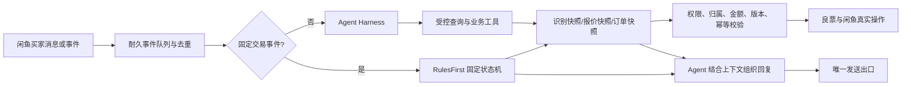

# V4 客服 Agent Harness 与良票固定交易链路优化计划

> 文档状态：实施中；以当前源码、良票开放平台文档和自动化测试为准，不把规划项写成已完成项。
> 核心目标：识别、权威确认、报价、闲鱼订单绑定、改价、付款、出票和售后保持固定状态机；除此之外的理解、追问、解释和回复由 Agent 完成。Agent 可以直接回复并调用受控工具，但不能绕过后端状态、归属、金额、幂等和权限校验。

## 1. 本次结论

当前识图问题不是良票接口能力不足，主要是 V4 的适配和 Harness 架构没有完整消费接口结果。

良票识图接口已经返回两层信息：

1. `rawResults`：截图原文识别结果，用于解释图片里实际出现了什么；
2. `finalResults`：良票匹配后的权威影院、影片、场次、座位、价格档位和候选项；
3. `recognizeId`：后续调用 `/api/v1/recognize/confirm` 的依据；
4. `requestId`：接口问题追踪依据。

本轮审计发现的原始架构损失包括：

- 把 `rawResults` 和 `finalResults` 压平成一个 `MovieImageInfo`，丢失原始层级和未知字段；
- 候选影院、影片、场次被限量并挑字段保存，接口升级后的附加字段会丢失；
- `requestId`、完整响应和确认链路没有形成可追踪的识别快照；
- `resolve_cinema`、`resolve_showtime` 主要修改本地 DTO，没有稳定调用良票 `/recognize/confirm` 收敛权威结果；
- 缺少 `resolve_movie`；
- Agent 报价工具允许模型重新提交影院、场次和座位字段，而不是由服务端从持久化识别快照重建请求；
- 多张图只生成一个合并识别对象，两张不同选座图会因座位不同被误判为冲突；
- 候选持久化类已存在，但生产装配没有注入，进程重启后候选上下文会丢失。

其中“两层结果无损保存、正式识别快照、按 target 分槽的官方候选确认、快照引用报价、两张选座图拆分、跨会话订单查询封堵、旧代际回调隔离、逐图失败隔离、AI 超时非静默降级、LIMIT 失败后关闭闲鱼原订单并在 closed 后再询问 FIXED”已经落地。剩余核心问题是报价与发送绑定、工具面去重、`show.list` 候选迁移、工具契约统一、性能与真实凭证灰度验证。下面的问题矩阵以最新源码为准。

因此应修复的是“接口适配层 + 识别快照 + 固定交易状态机 + Agent 工具边界”，不是再增加一批猜意图关键词。

## 2. 目标架构

### 2.0 2026-09-01 当前实施快照

本轮已落地并通过测试：

- 识别 DTO 无损保留 `rawResults / finalResults / rawResponse / candidates / requestId / traceId` 和未知枚举；
- `recognize/confirm` 已支持 `cinemaId / movieId / showId / cityName`，影院、影片、场次选择工具会在存在 `recognizeId` 时调用官方确认；
- 补齐良票城市、区划、影片、可售日期、催单、退票、退票详情和余额客户端；
- 候选上下文存储已注入生产装配，不再只存在进程内；
- 知识库按真实 `current_stage` 注入，删除固定“正确”关键词和大量“一失败就转人工”种子文案；
- ChatService 不再在 `tool_not_allowed` 后自行回退全局执行器；图片请求执行器仍显式委托少量全局只读工具，尚待收口为真正的请求级唯一边界；
- 图片进入 Hybrid 后由固定层先识别和预报价，再交 Agent 组织回复；AI 超时有基于权威事实的降级回复；
- 两张选座图生成两个独立 quote target；选座图 + 场次图生成一个增强 quote target；
- 多图改成逐张失败隔离，第二张超时不会丢弃第一张已识别 target；纯场次图没有座位时禁止执行选座预报价；
- 新增加密 SQLite Recognition Snapshot：按租户、店铺、买家、会话和 target 分槽，支持 TTL、revision CAS、事件幂等、确认历史、未知供应商字段无损保存和进程重启恢复；
- 生产报价路径在启用 Snapshot Store 时只认 `snapshot_id + snapshot_revision + target_id`，模型重写的影院、影片、场次和座位不会成为报价输入；
- 公开聊天 API 不再注册真实订单查询工具；伪造 native/JSON 工具调用也会在执行器前拒绝，请求级当前订单查询仍可用；
- 良票回调已绑定 `providerOrderNo / outOrderNo / quote generation`；旧代际 `ticketed/failed` 仅记审计，不推进当前交易、不发送旧票码；
- Agent-safe 识别结果已递归剥离截图价、座位截图价、供应商价格和 `raw_response`，完整数据只保存在加密审计快照；
- 普通文字 AI 超时不再静默，使用当前阶段的确定性引导回复；“好的/谢谢/OK”不再被固定售后意图抢答，只有明确状态问题才走固定状态回复；
- LIMIT→FIXED 关闭链已实现：验签且属于当前代际的 LIMIT `order.failed` 才会生成耐久闲鱼原订单关闭命令；Runtime 校验租户、会话、订单和付款状态，权威重读 `closed` 后才询问是否切换 FIXED；结果未知时只读对账，不重复取消；
- 四类候选/冲突确认已强制使用 `snapshot_id + snapshot_revision + target_id`，校验当前买家原文和候选归属，通过 CAS 生成新 revision 并写入确认历史；
- “好的”在已有座位、张数和有效报价时不再重复询问，提示按当前报价拍下。

当前最新全量验证：Python `580 passed, 31 xfailed`；Node 插件 `124 passed`；Ruff、Python compileall、`git diff --check` 通过。`31 xfailed` 主要是删除旧关键词意图后保留的迁移期用例，不能永久当作完成证据；其中候选确认和纠座必须用新 Snapshot Agent E2E 替代。当前本地无 Chat API Key、良票 AppKey/Secret 和 `backend/.env`，因此真实模型、真实良票识图/预报价与生产部署均尚未验收。

仍需继续完成，按优先级排序：

1. 合并 `get_quote / get_authoritative_quote / order.preflight / reprice_seats`，最终只保留 `quote.preflight_current` 和 `recognition.resolve_seats`；
2. 将 `show.list` 动态生成的场次候选从会话单槽迁入按 target 分槽的 Snapshot revision；
3. 删除图片请求执行器对私有全局 executor 的委托，所有良票只读工具改成显式请求级白名单；
4. 将报价发送护栏从“本轮出现过的金额集合”升级为 `quote_id + quote_revision + target_id + generation` 绑定，并贯通闲鱼改价和付款后建单；
5. 统一工具 schema 与执行能力：修复 `recognize_screenshot` 多图声明与单图执行的不一致，移除已被当前会话查询取代的任意订单参数；
6. 给同步识别设置独立 5–6 秒预算，超时使用稳定 `outTradeNo` 切异步识别/轮询，并持久化 attempt/result 避免重启后重复计费；
7. 清理无达路的旧失败/人工/一口价模板，修正“工具超限必须 handoff”与实际不创建人工任务的提示词冲突；
8. 用新 Snapshot Agent E2E 替换候选确认、纠座等迁移期 `xfail`，重跑完整 Python/Node/静态检查和多轮会话模拟；
9. 在服务器凭证环境执行真实模型 B 层和良票只读 C 层验证，审计 release 内容，取得部署确认后再切换生产。



责任划分：

| 层 | 负责 | 不负责 |
|---|---|---|
| 固定状态机 | 平台事件、识别门禁、报价有效期、闲鱼订单绑定、改价、付款后下单、回调、退款/换渠道状态 | 猜买家问法、固定模板抢答普通咨询 |
| Agent | 理解当前问题、补齐缺失信息、选择允许的查询工具、解释工具结果、自然回复 | 自造影院/场次/座位/价格/订单状态，直接写数据库或绕过状态机 |
| 工具层 | 参数校验、权限、会话归属、快照重建、幂等、调用良票/闲鱼、返回结构化事实 | 接受任意模型参数后直接写业务状态 |
| 知识库 | 店铺政策、流程说明、常见问题、按阶段注入 | 覆盖实时订单、价格和出票事实 |

## 3. 固定流程与 Agent 的准确边界

### 3.1 固定流程必须保留

1. 消息/订单/付款/退款/回调事件验签、去重和顺序控制；
2. 识别结果的 `EXACT / CANDIDATE / NONE` 门禁；
3. `SHOW_EXPIRED`、`seatMatched=false`、`priceMismatch=true` 的禁止报价规则；
4. 候选必须由买家选择，禁止默认第一项；
5. 只有 `/order/preflight` 返回金额可以成为对买家报价；
6. 报价快照与买家、会话、场次、座位、数量、渠道、有效期绑定；
7. 闲鱼拍下后按有效报价改价，付款后才允许创建良票订单；
8. 每轮最多一个写动作，写动作带幂等键并进行版本/CAS 校验；
9. 出票、票码、退款结果只认良票回调或权威订单查询；
10. `FAILED` 订单已释放冻结资金，禁止再调用良票 `/order/refund`。

### 3.2 Agent 负责

1. “多少钱一张”等普通咨询的自然引导；
2. 根据工具返回判断缺的是城市、影院、影片、日期、场次、座位还是数量；
3. 向买家展示候选并理解买家的当前选择；
4. 处理“9排的13 14”等座位纠正并调用重新预报价工具；
5. 解释识别失败、场次过期、座位售出、孤座限制、报价过期、出票中等事实；
6. 在固定状态机允许时发起受控工具调用；
7. 特惠失败后说明失败并询问是否改用一口价；
8. 使用当前会话历史回答追问，不重复询问已确认字段。

### 3.3 不再保留的硬编码意图

- 用“好的、可以、嗯嗯、收到、行吧”单独认定下单；
- 从任意历史消息抽取数量；
- 用关键词覆盖 Agent 已生成的回复；
- 普通文字先命中固定模板，导致 Agent 没有介入机会；
- 买家纠正座位后强制重新发截图；
- 把识别失败统一回复为“请重新发截图”，不说明真实缺失项；
- 把所有工具异常立即转人工。

固定事件识别不是“猜意图”：闲鱼订单创建、改价结果、付款、退款申请和良票回调都由平台结构化事件决定。

## 4. 良票识别快照 V2

### 4.1 数据模型

新增持久化 `RecognitionSnapshotV2`，至少保存：

- 身份：`tenantId / shopId / buyerId / chatId / eventId / imageId / imageUrlHash`；
- 链路：`recognizeId / requestId / traceId / cached / createdAt / expiresAt / revision`；
- 原文：完整 `rawResults`；
- 权威结果：完整 `finalResults`；
- 候选：完整 `finalResults.candidates` 原对象；
- 规范化字段：影院、影片、场次、座位、门禁标志和可报价状态；
- 原始未知字段：原样保留，避免良票新增字段后被适配层静默删除；
- 确认历史：每次 `/recognize/confirm` 的请求选择、响应和新 revision。

未知枚举不能被改成 `None`。规范化字段可以标记为 `UNKNOWN`，但原始值必须保留。

### 4.2 权威确认

`/api/v1/recognize/confirm` 支持 `cinemaId / movieId / showId / cityName`，至少提供一个标识。流程必须支持多轮收敛：

1. 识图返回 `CANDIDATE`；
2. Agent 展示必要候选；
3. 买家明确选择；
4. 后端校验选择确实属于当前识别快照；
5. 调良票 `recognize/confirm`，不能只改本地字段；
6. 保存新 revision；
7. 仍为 `CANDIDATE` 时继续询问下一项；
8. 只有 `EXACT` 且报价门禁全部通过，才能预报价。

工具拆分为：

- `recognition.get_current`：读取当前识别快照；
- `recognition.confirm_cinema`；
- `recognition.confirm_movie`；
- `recognition.confirm_show`；
- `recognition.resolve_seats`：买家纠正座位时在权威座位图内校验；
- `quote.preflight_current`：只接受快照 ID、revision、渠道模式和当前买家确认，不接受模型重新填写影院/场次/价格。

### 4.3 价格数据使用规则

- `rawResults.priceAll`：截图展示金额，只能用于解释和复核；
- `finalResults.seat[].seatPriceFen`：截图座位价格，不是供应商应付价；
- `finalResults.prices[]`：场次档位元数据，可以判断渠道可用性，不能直接作为选中座位成交报价；
- `/order/preflight.totalAmount`：唯一可向买家确认的成交报价；
- 服务端耐久快照完整保存上述价格字段，便于审计；Agent-safe 视图不下发 `priceAll / seatPriceFen / prices[].price / rawResponse` 等未成交金额，只提供 `priceMismatch`、渠道可用模式和候选事实；
- Agent 唯一可见并可对买家输出的金额来自当前有效 `/order/preflight` quote snapshot；输出必须绑定 `quoteId + revision`，不能只靠金额文本正则。

## 5. 多图处理规则

每张图片先独立识别，再按角色分组，不能先把所有字段压成一个对象。

### 5.1 两张都是选座图

- 每张图建立独立 quote target；
- 每个 target 独立确认、预报价和保存 quote snapshot；
- 座位不同不是冲突；
- 回复必须分别标识“第1张 / 第2张”对应影院、场次、座位和价格；
- 任一张失败不阻塞另一张成功报价；失败项单独说明原因。

### 5.2 一张选座图 + 一张影院/场次图

- 选座图是唯一 quote target；
- 影院/场次图是 supplemental context；
- 仅补充相容且选座图缺失的影院、影片、日期、场次字段；
- 有冲突时要求买家确认，不能覆盖选座图权威结果；
- 最终只执行一次预报价。

### 5.3 没有选座图

- 影院/场次列表图可以帮助 Agent 确认买家咨询对象；
- 不把页面展示价当成交价；
- 引导选择具体场次并发送选座图，或在文字信息完整时继续查场次/座位图。

### 5.4 分组键

优先使用权威 ID：`cinemaId + movieId + showId`。没有 ID 时才使用规范化的影院、影片、日期、时间作为暂时候选键。分组结果必须保留图片索引和识别快照 ID。

## 6. 报价、下单和出票固定状态机

### 6.1 报价

```text
RECOGNIZED
→ NEED_CONFIRMATION（存在候选）
→ EXACT
→ PREFLIGHTING
→ QUOTED（金额、座位、数量、渠道、有效期已绑定）
→ QUOTE_EXPIRED / BUYER_CONFIRMED
```

报价工具由服务端从识别快照构造：

- `showId` 必须来自已确认快照；
- 座位必须来自识别快照或买家当前纠正后通过座位图校验的结果；
- `ticketMode / priceMode` 来自店铺路由规则；
- Agent 不计算加价；
- 报价过期、快照 revision 改变或买家又发新图时，旧报价自动失效。

### 6.2 闲鱼拍下、改价、付款

1. 买家文字“确认”只记录对当前报价的确认，不创建良票订单；
2. 收到真实闲鱼 `order.created` 后，按买家、会话、数量和有效报价绑定；
3. 改价金额必须来自已绑定报价；
4. 收到改价成功结果后才可以告诉买家已改价；
5. 收到真实付款事件后，再次校验金额、数量、报价 revision 和订单归属；
6. 校验通过后固定状态机调用 `/api/v1/order/create`；
7. Agent 负责解释当前状态，但没有权限绕过这些门禁。

### 6.3 出票与售后

- `order.ticketed / ticket.updated`：更新票码/取票链接并发货；
- `order.failed`：记录失败原因，停止原订单继续出票；
- `order.cancel`：仅用于出票中拦截，`success=false` 仍要等待最终回调；
- `order.urge`：只用于 `TICKETING`，不改变状态；
- `order.refund`：只用于已经出票且满足退票条件的订单；
- `order.refund/detail`：查询已经发起的退票；
- `FAILED`：冻结已释放，禁止调用退款接口。

## 7. 特惠失败切换一口价

目标链路必须是“原闲鱼订单退款/关闭后重新拍下”，不能在买家说“可以”后直接创建第二个良票订单。

```text
LIMIT 出票失败
→ 固定状态机记录失败和失败金额
→ 处理原闲鱼订单退款/关闭
→ Agent 询问是否改用一口价
→ 买家明确同意
→ 对原场次和座位执行 STANDARD + FIXED 预报价
→ Agent 告知新价格并要求重新拍下
→ 收到新的闲鱼 order.created
→ 按新报价改价
→ 收到新的付款事件
→ 创建新的 FIXED 良票订单
```

必要门禁：

- 只允许从 `STANDARD + LIMIT` 失败进入；
- 原失败订单不得调用良票退款；
- 必须先完成原闲鱼订单退款/关闭；
- 买家同意仅授权重新报价，不授权直接扣款或下单；
- 新旧闲鱼订单号、报价 ID、良票订单号必须完全隔离；
- 切换上下文默认 30 分钟过期；
- 买家拒绝、超时、提交退款或发新选座图时终止；
- FIXED 第二次失败不再自动换渠道，创建静默人工任务并如实告知买家失败。

后台必须维护独立的 `liangpiao_limit_rules` 和 `liangpiao_fixed_rules`，不能用同一份加价规则替代。

## 8. Agent Harness 优化

### 8.1 每轮循环

1. 读取当前事件、最新买家消息和持久化会话状态；
2. 固定事件先交状态机推进；
3. 生成只包含当前阶段所需事实的上下文；
4. Agent 决定直接回复或调用允许工具；
5. 查询工具可以连续调用，但设置最大轮数、总超时和 token 预算；
6. 每轮最多一个写动作；
7. 工具结果回注 Agent；
8. 最终回复经过价格、订单状态、票码和敏感字段护栏；
9. 通过唯一发送出口写入发送命令；
10. 记录每一步耗时、工具、结果、重试和最终原因。

### 8.2 工具安全

当前大量 `additionalProperties: true` 需要改为窄 schema。每个工具必须：

- 明确 required 字段、类型、长度、枚举和最大数组数量；
- 从服务器当前会话绑定身份，不接受 Agent 传 `tenantId/shopId/buyerId/chatId`；
- 订单查询只允许当前会话已绑定订单，不能接受任意订单号跨会话读取；
- 报价只接受快照 ID/revision，不接受模型重写金额和权威 ID；
- 写工具带 action token、幂等键、预期状态和预期 revision；
- 工具返回业务错误码、可恢复性和建议下一步，不能只有 `tool_not_allowed`；
- request-level executor 存在时禁止因为 `tool_not_allowed` 自动回退到全局 executor。

删除语义重复的工具别名，最终至少统一为：

- 查询：`recognition.get_current`、`cinema.list`、`show.list`、`show.detail`、`seat.list`、`quote.preflight_current`、`order.get_current`；
- 选择：`recognition.confirm_cinema/movie/show`、`recognition.resolve_seats`；
- 受控写入：`quote.confirm`、`order.bind_xianyu`、`order.change_price`、`order.create_after_paid`、`order.cancel`、`order.urge`、`refund.apply`；
- 运维：`manual_task.create`，只在确定需要人工时调用。

### 8.3 失败恢复，避免滥用人工

| 失败 | 第一次 | 再次失败 | 人工条件 |
|---|---|---|---|
| AI 超时 | 用结构化事实生成简短确定性回复；后台可异步重试 | 缩短上下文/切换备用模型 | 连续失败且买家问题无法由固定信息回答 |
| 识图网络超时 | 原请求幂等重试一次 | 告知暂时识别失败，请重发原图 | 多次失败或接口返回未知状态 |
| 候选不唯一 | Agent 展示候选 | 继续等待买家选择 | 不转人工 |
| 报价不可用 | 告知具体门禁并引导补充/换座 | 重新预检一次 | 金额不一致、规则缺失或供应商返回未知状态 |
| 写动作结果未知 | 先查幂等记录/订单详情 | 禁止重复写 | 查后仍无法确定 |
| 订单归属冲突 | 停止自动操作 | 创建人工任务 | 立即人工 |
| 二次 FIXED 失败 | 如实告知失败 | 不再自动重试渠道 | 静默创建人工任务 |

### 8.4 性能

模型慢不能靠再加硬编码意图解决。优化顺序：

1. 固定识别和查询可并行执行时并行，不等待 Agent 决定是否识图；
2. 识别结果按图片哈希、店铺和配置版本缓存；
3. 上下文使用结构化会话摘要，不每轮发送 20 条完整历史；
4. 知识库按 `current_stage` 检索，不全量注入；
5. 提示词拆为稳定系统协议 + 短运行时状态；
6. 普通 FAQ 使用低延迟模型，交易工具编排可使用更强模型；
7. AI 超时后确定性降级回复，不让买家无响应；
8. 分开记录消息合并、状态机、识别、良票、模型、发送耗时。

## 9. 知识库与提示词

知识库按运行时 `current_stage` 注入：

- `CONSULTING`：购票方式、截图要求、时效；
- `IDENTIFYING`：缺失字段和候选选择；
- `QUOTED`：报价有效期、拍下和改价说明；
- `WAITING_PAYMENT`：付款提示；
- `TICKETING`：出票时效、催促和取消语义；
- `TICKETED`：取票、观影和售后；
- `FAILED`：失败、退款和一口价切换；
- `REFUNDING`：退票进度。

提示词只说明权限、事实来源、工具使用和回复原则，不堆叠买家关键词。必须删除乱码文本和互相冲突的旧文案。

## 10. 当前代码审计矩阵

这里明确区分“已解决”和“仍需处理”，后续开发不得再按旧问题清单重复劳动。

### 10.1 已解决并有自动化测试

1. `rawResults / finalResults / rawResponse / candidates / requestId / traceId` 已无损保留；
2. 官方确认已支持影院、影片、场次和城市，并校验选择属于当前候选；
3. 候选存储已注入生产装配；
4. 两张选座图会生成两个 quote target，不再把座位不同当作冲突；
5. 一张选座图加一张场次图只生成一个增强 target；
6. 图片链路固定层先识别和可执行预报价，Agent 只组织表达；
7. LIMIT 失败后不会仅凭文字直接创建 FIXED 良票订单；旧订单未关闭、新闲鱼订单未改价付款时均被门禁阻止；
8. 请求级 executor 拒绝工具后，ChatService 不再自行回退全局 executor；
9. 知识库已按 `current_stage` 注入；
10. 良票城市、区划、影片、可售日期、催单、退票、退票详情和余额客户端已补齐；
11. 正式 Recognition Snapshot 已建立：加密 SQLite、target 分槽、TTL、revision CAS、确认历史、幂等、跨身份拒绝和重启恢复均有测试；
12. 生产报价工具已从当前快照重建请求，模型重写影片、场次和座位不会覆盖快照；
13. 公开聊天入口不再暴露真实订单工具，伪造工具调用在执行前被拒绝；
14. 旧代际良票 `ticketed/failed` 回调不会推进当前交易或发送旧票码；
15. 多图逐项失败，成功图片保留；纯场次图无座位时不预报价；
16. Agent-safe DTO 不再携带嵌套截图价、供应商价和完整 `raw_response`；
17. 普通文字 AI 超时有确定性回复，不再返回空 action；
18. “好的/谢谢/OK”交给 Agent，固定状态回复只处理明确订单状态询问；
19. `resolve_cinema/movie/show/conflict` 已强制带快照、revision 和 target，校验当前买家原文、候选归属并写入官方 confirm 历史；
20. LIMIT 失败后的闲鱼原订单关闭命令、Node 执行授权、结果回传和 closed 后 FIXED 询问已接通；未 closed 前不询问切换，未知结果不重复取消；
21. 无真实人工任务的非法 JSON、工具失败、预算耗尽等 ChatService 分支已改为“稍后重试/尚未完成核验”，不再虚假声称已转人工。
22. 本轮模拟报告已标明 A/B/C 证据等级，当前无凭证时不再冒充真实模型或良票结果。

### 10.2 P0：上线前必须解决

1. **价格回复还没有绑定具体 quote revision。** 当前输入已从 Snapshot 收口，但发送前主要校验“回复中金额是否属于本轮权威金额集合”。相同金额可能属于不同 target/场次/代际，所以必须升级为 `quote_id + quote_revision + target_id + generation` 的发送 token，发送前重读有效性。
2. **Snapshot→Quote→Xianyu Order→Liangpiao Order 的同一代际缺一条完整 E2E 断言。** 买家发新图、确认新 target 或纠座后，旧 quote 必须无法绑定新闲鱼订单；改价、付款后建单和回调都要断言同一 generation。
3. **生产真实验证尚未执行。** 当前只能证明本地单测/集成测绿色，不能证明服务器凭证、真实两图识别、只读预报价、真实模型多轮、闲鱼关单权限和线上 release 已对齐。

### 10.3 P1：灰度前必须解决

1. **重复报价工具造成策略漂移。** `order.preflight / get_quote / get_authoritative_quote / reprice_seats` 仍指向相近能力。统一为 `quote.preflight_current`，纠座使用独立 `recognition.resolve_seats`；幂等键包含 snapshot revision、target 和渠道。
2. **图片请求仍显式委托全局只读 executor。** ChatService 已禁止自动越权回退，但图片 request executor 对 `cinema/show/seat` 仍读取私有 `_tool_executor`。改成请求级显式白名单，且身份和当前快照由服务端绑定。
3. **同步识别超时未独立。** 给 `/recognize/seat-shot` 约 6 秒独立预算；超时后使用异步识别或短轮询，不等待模型 20 秒总超时。
4. **工具错误尚未完全结构化。** 统一返回 `errorCode / recoverable / retryAfter / missingFields / suggestedNextAction`，Agent 不再分析供应商中文字符串。
5. **`show.list` 候选仍是会话单槽。** 识图返回的候选已按 target 分槽，但 Agent 后续调用 `show.list` 生成的候选仍保存到 `_pending_show_candidates`/兼容存储，两个同时目标会互相覆盖。
6. **工具 schema 与执行器有不一致。** `recognize_screenshot` 对模型声明支持 1–3 张，但全局执行器只取 `image_url`；`order.detail` schema 还接受 `outOrderNo/order_id`，良票客户端已收紧为只接受 `orderNo`。这些将导致模型选择合法 schema 却必然执行失败。
7. **提示词与实际恢复协议有冲突。** 提示词仍写“超过三次必须 handoff”，代码则正确地返回 `retry_later`且不创建人工任务。应该以 `recovery.next_action + manual_task_created` 为唯一真相。
8. **AI 延迟优化未完成。** 已消除失败静默，但当前仍会携带最多 12 条、每条最多 2000 字的历史，系统提示、阶段知识和工具 schema 也会叠加。要使用结构化交易摘要 + 最近 4–6 条原文，并分段记录 p50/p95。
9. **识图幂等只在进程内完整。** 多图尝试计数和成功缓存仍保存在 `_agent_image_attempts/_agent_image_results` 内存中；同步识别超时后没有自动切换带稳定 `outTradeNo` 的异步任务，重启或重复投递可能再次计费。
10. **良票接口仍需继续窄化。** 已修正 `order/create`、`order/detail`、`order/cancel`、traceId 和网络未知重放；但 `brand/cinema/show/seat/preflight/order-list` 底层仍有通用 mapping 方法，`areaQuoteStrategy`、cancel 两段式语义、`pickupUrl/version/estimatedSettleAmount` 的重启投影仍需逐项验收。
11. **迁移期 xfail 缺少新 E2E 替代。** 删除“好的/数量/确认”关键词硬编码是正确方向，但候选确认、纠座、跨轮恢复必须有新 Snapshot Agent 工具用例，不能只把旧测试标记 xfail。

### 10.4 P2：可观测性与运营

1. 按一轮会话保存消息合并、规则、识图、官方确认、预报价、Agent、发送各段耗时和 p50/p95；
2. 增加识别快照诊断页，可查看原文、权威结果、target、revision、确认历史和关联报价，但隐藏敏感字段；
3. 按失败原因统计识图、候选确认、预报价、下单、出票和 LIMIT→FIXED 转化；
4. 统一规范和模拟报告必须附具体测试时间、代码版本、生产 release 和真实良票 requestId，fixture 结果不得标成真实接口结果；
5. 报警至少覆盖：重复写动作、跨会话拒绝、报价 revision 冲突、回调验签失败、事件积压和 AI 静默降级。

## 11. 实施阶段与文件范围

执行顺序不能并行乱改交易边界，按下表依赖推进：

| 工作包 | 当前状态 | 依赖 | 本轮下一步产物 | 退出条件 |
|---|---|---|---|---|
| A. Recognition Snapshot V2 | 核心完成，`show.list` 候选迁移待完成 | 无 | 将动态场次候选写入对应 target revision；补纠座 Snapshot E2E | 所有候选、冲突、纠座都按 target 隔离，旧单槽不再影响交易 |
| B. Agent 工具收口 | 安全主链完成，别名和 schema 待统一 | A | 合并成 `quote.preflight_current`、`order.get_current`，删除私有全局 executor 委托，对齐多图 schema | Agent 参数不能覆盖身份、权威 ID、金额和当前订单；schema 与 executor 能力完全一致 |
| C. 多图 target 状态机 | 识别、拆分、合并和官方确认已完成 | A、B | 补两个 CANDIDATE target 跨轮确认 E2E 和报价发送 token | 一图失败不阻塞另一图；两个候选 target 可独立确认、报价和绑单 |
| D. LIMIT→FIXED 重新拍下 | 关单命令、结果回传、closed 后询问已完成 | B | 补真实闲鱼灰度权限与 unknown/closed 运行证据；清理旧无达路模板 | 旧订单权威关闭前和新订单付款前，FIXED 良票下单次数均为 0；未知结果不重复取消 |
| E. 良票客户端 | 主契约已修正，剩余可选字段和通用 mapping 收口 | 无 | 显式建模 `areaQuoteStrategy`、cancel 两段式、重启投影字段；逐接口窄参数测试 | 每个已开放接口有请求体等值测试，状态语义与文档一致，业务拒绝不被重试 |
| F. 回复、恢复与性能 | 非静默与关键词清理完成，契约/摘要待统一 | B、C | 结构化错误、修正 handoff 提示冲突、交易摘要、延迟分段指标 | 普通咨询 Agent 介入；AI/工具失败不静默、不虚假转人工；p95 达标 |
| G. 灰度与部署 | 未开始 | A–F | release 包、SHA256、服务器 release、灰度报告、回滚点 | 真实图片、真实预报价、真实订单事件链全部通过 |

建议按以下提交边界拆分，任一包失败可独立回退：

1. 快照存储与只读迁移，不改变现有报价行为；
2. 影子写入 snapshot/target/revision，并对比当前 DTO；
3. 报价工具切到服务端快照重建，同时关闭旧报价别名；
4. 订单工具切到当前会话绑定，关闭任意订单号入口；
5. 多图逐项失败和 target 独立确认；
6. 普通文字降级与剩余关键词抢答清理；
7. LIMIT→FIXED、重复事件、重启恢复全链回归；
8. 服务器真实凭证灰度；
9. 生产切换，保留上一 release 并验证回滚命令。

### 阶段 A：识别快照 V2（核心完成，`show.list` 单槽迁移待完成）

主要文件：

- `backend/app/models.py`
- `backend/app/liangpiao_client.py`
- `backend/app/liangpiao_recognition.py`
- `backend/app/service.py`
- `backend/app/recognition_snapshot_store.py`
- `backend/tests/test_recognition_snapshot_store.py`

当前已满足：完整两层数据和未知字段可恢复；快照按 target 保存；revision CAS、确认历史、TTL、加密、重启恢复；四类确认强制快照引用并调官方 confirm；生产报价从当前快照重建。剩余标准：`show.list` 后置候选和纠座结果也只写 Snapshot，去掉交易链中的旧单槽兼容状态。

### 阶段 B：Harness 和工具权限（部分完成）

主要文件：

- `backend/app/chat_service.py`
- `backend/app/prompts.py`
- `backend/app/knowledge_store.py`
- `backend/app/main.py`
- `backend/app/plugin_automation.py`

完成标准：工具窄 schema、无越权回退、阶段知识库、AI 超时有买家回复、每轮一个写动作、价格事实护栏通过。

### 阶段 C：多图报价（部分完成）

主要文件：

- `backend/app/plugin_automation.py`
- `backend/app/quote_record_store.py`
- 多图分组与 quote-target 辅助模块

完成标准：两张选座图两份独立报价；选座图加场次图一份报价；单图失败不阻塞其他图；每份报价可单独确认和绑定订单。

### 阶段 D：特惠失败换一口价（本地实现完成，待真实平台灰度）

主要文件：

- `backend/app/transaction_state_store.py`
- `backend/app/rule_state_coordinator.py`
- `backend/app/plugin_automation.py`
- `backend/app/liangpiao_callbacks.py`
- `backend/app/pricing_store.py`

已完成：LIMIT 失败生成闲鱼原订单关闭 command；平台结果回传并权威重读 closed；unknown 只读对账；closed 后才询问 FIXED；同意后只生成 FIXED 报价；旧代际回调不污染新交易；二次失败不循环。剩余验收：在灰度店铺证明闲鱼权限、关单回读和买家消息真实生效。

### 阶段 E：良票客户端补齐（契约修正进行中，待真实验证）

根据当前业务需要补充：

- 城市/定位/区划；
- 影片列表和详情；
- 可售日期；
- 订单催促；
- 退票和退票详情；
- 必要的账户余额只读诊断。

每个接口必须按本地良票文档核对请求字段、响应结构、状态语义、幂等和允许调用阶段，不能仅添加一个任意 `**kwargs` 透传方法。

本轮契约审计已经确认的具体项：

- `/order/detail` 只接受良票 `orderNo`，不能拿闲鱼订单号或 `outOrderNo` 代替；
- `/order/create` 首次响应丢失时，应使用完全相同的 `outOrderNo` 和请求体幂等重放 create，不能在尚无 `orderNo` 时查 detail；
- 业务拒绝（例如不支持档位、无供应商）不能按“响应未知”重试，只有网络/超时类未知结果可安全幂等重放；
- 内部 traceId 只进入 `X-Trace-Id` 请求头，不进入供应商请求体；
- `/recognize/seat-shot` 按文档约 5 秒独立超时；异步识别使用稳定 `outTradeNo`，重复事件不能重复计费；
- `order.failed` 禁止调用良票退票接口，但不等于禁止关闭/退款闲鱼原订单；两个平台动作必须在类型和文案上分开。

### 阶段 F：测试、模拟、灰度和部署（测试部分完成，部署未开始）

1. Python 单元与集成测试；
2. Node 插件事件测试；
3. 两张指定测试图片的真实识别或受控 fixture 回放；
4. 多轮买家会话模拟；
5. 并发、重复事件、超时和进程重启测试；
6. 代码审计和文档状态校正；
7. 打包、SHA256、服务器新 release 目录、切换 `current`、重启；
8. 生产只读健康、配置门禁和一组灰度会话验证；
9. 保留上一 release 作为回滚点。

## 12. 必测会话

1. “多少钱一张” → Agent 引导发送当前场次选座图或补全影院/影片/日期/场次；
2. 只发影院/场次列表图 → 识别为辅助图，不按截图展示价报价；
3. 只发完整选座图 → 固定识别和预报价，Agent 自然组织报价；
4. 同时发选座图和影院/场次图 → 合并上下文，只报价一次；
5. 同时发两张选座图 → 分别报价两次；
6. 第一张成功、第二张识别失败 → 返回第一张价格并单独说明第二张；
7. 影院/影片/场次存在多个候选 → 分别展示并调用官方 confirm；
8. `seatMatched=false` → 查询座位图或请买家重选，禁止下单；
9. `priceMismatch=true` → 说明需要复核，禁止把截图价当报价；
10. 买家说“9排的13 14” → 规范成 9排13座、9排14座并复用场次重新预报价；
11. 报价后说“好的” → 根据当前报价已知座位数量承接对话，不错误重复询问；若 W+ 无数量才询问张数；
12. 买家明确确认 → 只确认报价，等待真实闲鱼拍下；
13. 闲鱼拍下数量不匹配 → 不改价，Agent 解释需要重新拍；
14. 已付款 → 状态机创建良票订单，Agent 不提前声称已出票；
15. 出票中问“怎么还没出” → 查询权威状态并解释；
16. 获取票码但未出票 → 返回真实未出票状态；
17. LIMIT 失败 → 原闲鱼订单退款/关闭并询问是否一口价；
18. 买家说“可以” → 仅执行 FIXED 预报价并要求重新拍下；
19. 新闲鱼订单付款 → 创建新的 FIXED 良票订单；
20. FIXED 再失败 → 停止自动重试，告知失败并创建人工任务；
21. AI 11–22 秒超时 → 确定性回复先返回，不出现无回复；
22. 重复付款、重复回调、重复下单消息 → 幂等且只执行一次写动作；
23. 进程在候选确认中重启 → 候选和识别 revision 仍可恢复；
24. 跨买家伪造订单号 → 工具拒绝，不泄露订单信息。

## 13. 验收指标

- 错价率：0；截图价或场次档位价不能被当作最终成交价；
- 重复下单率：0；
- 跨会话读写：0；
- 两张选座图正确拆单报价：100%；
- 选座图 + 场次图正确合并：100%；
- 候选未确认时下单：0；
- LIMIT 失败后直接创建 FIXED 良票订单：0；
- 普通咨询 Agent 介入率：100%（固定平台事件除外）；
- 可恢复工具异常直接转人工比例：目标低于 5%；
- 每次交易都能用 `eventId + recognitionId + quoteId + xianyuOrderId + providerOrderNo` 串起审计链。

## 14. 上线顺序和回滚

1. 先上线数据模型与只读识别快照，保持旧流程可用；
2. 开启新识别快照但只做影子比对；
3. 灰度开启官方候选确认和服务端快照报价；
4. 灰度开启多图拆分；
5. 最后开启新的 FIXED 重新拍下链路；
6. 每阶段单独开关，异常可关闭新能力并回到旧 release；
7. 不允许数据库 schema 不可逆变更与代码切换同时发生；
8. 生产验证必须区分“服务健康”和“良票凭证/业务开关真实可用”。

## 15. 文档收口要求

实现完成后更新 `V4_UNIFIED_AGENT_LIANGPIAO_SPEC.md`：

- 删除与真实代码不一致的“已完成并部署”描述；
- 将旧的“文字确认后直接创建 FIXED 良票订单”改为“退款/关闭旧闲鱼订单后重新拍下、改价、付款”；
- 增加 Recognition Snapshot V2、官方多轮 confirm、多图 quote target 和失败恢复梯度；
- 附上实际测试数量、真实图片结果、部署 release、服务健康和业务路由验证证据。

## 16. 固定测试材料与证据格式

良票契约依据：`D:\13250\Users\良票开放平台-API接入文档 (2).md`。实现时重点核对 `/recognize/seat-shot`、`/recognize/confirm`、`/seat/list`、`/order/preflight`、`/order/create`、`/order/detail`、`/order/cancel`、`/order/urge`、`/order/refund`、`/order/refund/detail` 和回调状态机。

服务器真实验证固定使用：

1. `https://img.alicdn.com/imgextra/i1/2464035965/O1CN0133v5VBg1lvC0sG0H_!!2464035965-2-xy_chat.png`
2. `https://img.alicdn.com/imgextra/i1/2313315754/O1CN01T4hCpHVyl7L0sG0H_!!2313315754-0-xy_chat.jpg`

本地目视基线只用于预期对照，不能替代良票响应：第一张是已选座截图；第二张是影院/场次列表截图。真实验收必须保存每张图片各自的脱敏证据：

- HTTP 状态、`requestId / recognizeId / cached`；
- 完整 `rawResults / finalResults` 的结构哈希和脱敏归档；
- `isSeatSelection / matchLevel / noMatchReason / seatMatched / priceMismatch`；
- 三类候选数量和 confirm 后 revision；
- quote target 数量、每个 target 的图片索引和座位；
- `/order/preflight` 请求哈希、`priceMode / ticketMode / totalAmount / estimated`；
- 对买家最终回复及其绑定的 quoteId；
- 不得在报告中输出 AppKey、Secret、签名、手机号、完整票码或未脱敏取票凭证。

如果服务器没有良票凭证或报价开关未启用，结果只能标记为“环境阻塞”，不得用本地 fixture 冒充真实接口通过。

## 17. 本轮复核新问题与执行计划（2026-09-01）

### 17.1 本轮确认的架构边界

V4 应采用“固定交易状态机 + 请求级 Agent Harness”的混合架构：

1. 闲鱼/良票结构化事件先经过去重、签名、租户/店铺/买家/会话归属校验；
2. 识图与报价固定层读取良票权威结果，保存 rawResults、finalResults、candidates 和追踪号；
3. Agent 只负责理解买家问题、补问缺失信息、展示候选和组织回复，不自行拼接金额、订单号或票码；
4. 所有读取和写入工具均由当前请求 executor 显式提供，不得从进程级全局 executor 越权回退；
5. 唯一发送出口在发送前重读快照、报价版本、订单归属和付款状态，不匹配则不发送、不下单、不换渠道。

### 17.2 本轮发现的其他问题

| 问题 | 当前证据 | 影响 | 修复方式 | 验收标准 |
|---|---|---|---|---|
| 工具重复报价 | `main.py` 同时暴露 `order.preflight/get_quote/get_authoritative_quote/reprice_seats` | Agent 可选错工具，多次预检或使用旧参数 | 对外只保留 `quote.preflight_current`，旧名仅做后端兼容映射 | schema 中无重复报价工具，旧名调用不会创建第二份报价 |
| 请求级越权回退 | `plugin_automation.py` 对 `tool_not_allowed` 仍尝试读 `_chat._tool_executor` | 会话限制可被全局工具绕过 | 删除回退分支，只允许请求级白名单 | 被拒绝时返回结构化错误，不产生任意良票请求 |
| 多图 schema 与执行不一致 | schema 允许 `image_urls` 1–3 张，旧 executor 只读 `image_url` | 两张图可能被当成一张或被忽略 | 统一批处理、按图隔离失败、保留每图 target | 两张选座图产生两份 quote，一张失败不影响另一张 |
| `show.list` 候选仍是会话单槽 | `pending_show_candidates` 旧存储按会话键覆盖 | 同一会话两个场次目标互相污染 | 改为 Snapshot `target_id + revision` 分槽，选择时强制携带快照版本 | 两个 target 可同时保存、分别确认，旧 target 不能覆盖新 target |
| 报价回复只按金额护栏 | 当前只验证本轮出现过的金额集合 | 相同金额可来自不同场次或代际 | 发送 token 必须包含 `quote_id + quote_revision + target_id + generation`，发送前重读验证 | 旧报价、旧 target、旧 generation 均被拒绝 |
| 良票参数仍有通用 `**kwargs` | `brand/cinema/show/seat/preflight/order-list` 仍主要依赖通用 mapping | 文档参数变更时可能静默外传错参数 | 按文档建立显式请求模型与白名单，保留旧 camelCase 兼容入口 | 每个接口都有正常/边界/拒绝参数测试 |
| `areaQuoteStrategy` 未进入选座预检请求 | `SelectedSeatQuoteRequest` 和 `preflight_payload` 无该字段 | 供应商区域报价策略无法设置，可导致预检与下单不一致 | 新增 `AVERAGE/HIGHEST/LOWEST` 枚举、预检和创单使用同一值 | 预检、报价快照、`order/create` 请求体三者一致 |
| 同步识图超时无异步切换 | 同步 `/recognize/seat-shot` 只有 5 秒请求限时，超时后直接失败 | 买家只能重发图，重试可能重复计费 | 仅对网络/超时错误使用同一 `outTradeNo` 转异步任务，业务拒绝不重试 | 超时后只创建一次异步任务，重启后可恢复轮询 |
| AI 超时与回复延迟 | 当前请求可携带较长历史、知识和工具 schema | 普通问题可能等待 11–22 秒 | 使用阶段摘要 + 最近 4–6 条原文，工具结果内部结构化，记录 p50/p95 | 超时先返回可息息，不重复发送，延迟可观测 |

### 17.3 分阶执行顺序

**P0：上线前必须闭环**

1. 完成 `show.list` 候选的 Snapshot 分槽迁移；
2. 完成报价 token 与发送前重读，验证同一 generation 且关联当前 target；
3. 跑通 Snapshot→Quote→闲鱼 order→良票 order 的同一代际 E2E；
4. 在有真实凭证时执行良票识图、预检、回调和闲鱼回写灰度验证。

**P1：灰度前必须闭环**

1. 合并重复报价工具，移除请求级以外的 executor 回退；
2. 补齐 `areaQuoteStrategy` 、良票订单详情返回字段、取票链接和票据版本；
3. 完成同步识图超时的幂等异步转换和重启恢复；
4. 使用交易摘要、短上下文和 p95 指标优化 Agent 延迟。

**P2：可观测与运营**

1. 保留每次 `eventId→recognizeId→quoteId→xianyuOrderId→providerOrderNo` 审计链；
2. 按错误码统计识图、预检、下单、出票和换渠道失败；
3. 每个阶段保留独立开关、发布包 SHA256、健康检查和回滚记录。

### 17.4 当前验证基线与不能声称的内容

- 本地 Python：`580 passed, 31 xfailed`；Node 插件：`124 passed`；ruff、compileall、`git diff --check` 已通过。
- 当前环境没有 Chat API Key、良票 AppKey/Secret 和 `backend/.env`，因此不能声称真实模型、良票接口、闲鱼回调或生产部署已通过。
- 两张阿里图片仅能作为本地 fixture 输入；不能将 fixture 结果冒充为良票真实返回。
- 部署必须等待凭证、灰度验证和用户明确放行；现阶段文档是执行计划，不是生产已完成声明。
- 本轮已在本地补齐 `area_quote_strategy` 的 `AVERAGE/HIGHEST/LOWEST` 枚举，并使预检快照与 `order/create` 复用同一配置；良票其余接口显式建模与真实凭证验收仍在 P1/P0 门禁内。
