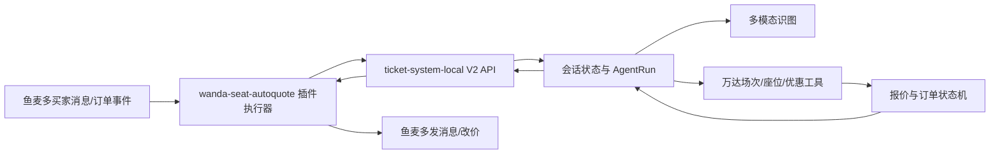

# 万达电影票纯 AI 客服 V2 重建计划（已废止）

> 状态：仅保留历史审计；模型主导、Shadow/Canary和模型回复所有权条款均不得用于正式交易。当前唯一规范为 `E:\鱼麦多\V3\docs\RULES_FIRST_TRANSACTION_PLAN.md`。
> 插件 ID：`wanda-seat-autoquote`（保持不变）。

## 1. 已确认的产品决策

1. V2 只建设“纯 AI”链路，不把 OCR 主链路混入 V2。
2. 多模态模型直接读取完整原图，负责理解可见事实和买家意图。
3. AI 只负责理解、规划和回复；影院、场次、座位、优惠、金额、订单状态必须由后端工具核验。
4. W+ 座位通过临时锁座后的 `/api/order/available-offers` 查询“W+会员专享优惠”。
5. 默认排除“W+周五会员日专享”；后台提供独立开关，开启后才允许使用该活动。
6. 手画圈位于 W+ 区域但无法识别准确座位号时，临时选择一个可售 W+ 座位查询单价；报价只代表该场 W+ 参考单价，出票仍按买家原图核对。
7. 所有临时锁座必须在 `finally` 中立即释放；释放结果必须留痕，禁止遗留占座。
8. 当前阶段付款后转人工出票，不自动出票、发货、催收货或评价。
9. 新 V2 不读取、不导入、不调用旧插件源码、旧数据库或旧 bridge 接口。

## 2. 系统边界



### `E:\ticket-system-local`：业务大脑

- 完整会话上下文和状态重建。
- 多模态图片识别与结构化校验。
- Agent 规划、工具调用、提示词和知识库。
- 万达影院、场次、实时座位和优惠接口适配。
- 临时锁座、查优惠、释放和异常补偿。
- 报价计算、报价快照、订单绑定、改价授权和付款核验。
- AgentRun、ToolCall、QuoteTask、OrderBinding 和审计日志。

### `E:\鱼麦多\万达电影票 AI 客服插件`：平台执行器

- 使用鱼麦多官方 SDK 注册同名插件。
- 接收并验签消息、订单和人工消息事件。
- 拉取鱼麦多最近会话，传给 V2 后端。
- 执行后端授权的 `send_message` 和 `change_order_price`。
- 改价后回读订单金额并回传结果。
- 保存事件幂等、动作回执和结果未知状态。
- 不包含识图提示词、报价公式、知识库或 Agent 决策。

## 3. 统一 AgentRun

每条买家文本或图片都进入同一个 AgentRun：

```text
读取同会话快照
→ 判断当前业务阶段
→ 选择一个后端工具
→ 保存工具参数和结果
→ 根据新事实继续调用工具或生成回复
→ 安全层审核动作
→ 插件执行并回传平台回执
```

每轮必须读取：

- 最近买家、AI、卖家和人工双向消息。
- 最新不可变原图、图片哈希和识图版本。
- 已确认的影院、影片、日期、场次、影厅、座位类型和选座方式。
- 最近一次场次匹配、实时座位和优惠查询结果。
- 未过期报价任务及其价格证据。
- 订单绑定、改价、付款、退款和人工接管状态。
- 已执行工具、已发送动作及平台回执。

新消息只能合并到现有会话状态，不允许每条消息从空白 extraction 重新开始。

## 4. 图片识别设计

### 4.1 模型输入

- 使用买家发送的完整原图，不裁切关键区域。
- 图片使用高细节模式，并绑定 SHA-256、平台消息 ID、会话和 AgentRun。
- 同时提供买家本轮文字和经过脱敏的必要会话事实。
- 不把报价结果、猜测结果或旧截图价格当成视觉事实回填给模型。

### 4.2 模型输出

必须通过严格 JSON Schema，至少包含：

- `image_kind`：座位图、订单确认页、其他。
- `cinema_brand`：`WANDA`、`OTHER`、`UNKNOWN`。
- `cinema`、`movie`、`date`、`showtime`、`hall`。
- `selection_kind`：官方已选、买家手画圈、未选、未知。
- `seat_type`：`WPLUS`、`REGULAR`、`UNKNOWN`。
- `selected_seats`、`selected_seats_legible`。
- `circled_region`、`visible_ticket_count`。
- `screenshot_prices`：仅记录图片可见价格，单位为分。
- 每个字段的 `confidence` 和可见证据说明。

### 4.3 识别规则

- 官方选中以勾选状态、底部选座卡片或订单页具体排座为证据。
- 手画圈只证明买家关注区域，不自动等同于官方已选。
- 圈中 W+ 标记才可判定为 W+ 区域；不能仅凭颜色或图例猜测。
- 手画圈内准确座位号不清楚时，`selected_seats=[]`，不能编座位号。
- 图片价格只是证据，绝不能直接生成最终报价。
- 非万达图片不调用万达场次、座位、优惠或改价工具。

## 5. 场次和座位核验

1. 使用影院、影片、日期、开场时间和影厅匹配唯一场次。
2. 匹配不唯一时只补问一个最关键字段，不报价。
3. 取得真实场次后查询实时座位图。
4. 官方已选座必须逐个核验座位存在、可售、区域和 W+ 标记。
5. 买家手画圈且已确认属于 W+ 区域时，从该场可售 W+ 座位中选择一个探价座位。
6. 普通座手画圈但没有准确座位号，本阶段禁止自动报价，转为补问或人工复核。
7. 探价座位只用于查会员活动价格，不作为最终出票座位承诺。

## 6. 临时锁座与优惠查询

### 6.1 W+ 座位

```text
确定场次
→ 选择买家官方已选 W+ 座位，或一个可售 W+ 探价座位
→ 临时锁座
→ GET /api/order/available-offers
→ 查找活动名精确属于“W+会员专享优惠”的可用活动
→ 读取 allot_seat.totalPayPrice 和 dtItemList[].payPrice
→ finally 释放临时锁座
```

活动选择规则：

- 默认只接受“W+会员专享优惠”。
- 名称包含“W+周五会员日专享”的活动默认排除。
- 后台开启周五开关后，才允许把周五活动纳入候选。
- 必须保存活动名称、活动代码、整单价、单票价、查询时间和锁座 ID。

### 6.2 普通座位

- 官方已选普通座必须按该具体位置查询对应的真实会员成本。
- 不能把普通座锁座后返回的原价误认为会员成本。
- 由万达接口适配层输出统一的 `verified_member_unit_price_cents`。
- 如果接口不能唯一证明该位置的会员成本，则禁止自动报价并进入人工复核。

### 6.3 释放保证

- 锁座成功后立即登记 `temporary_lock`。
- 查询成功、失败、超时或任务取消都必须执行释放。
- 释放失败进入高优先级异常队列，并由补偿任务继续对账释放。
- 日志必须展示 `lock_succeeded`、`offer_queried`、`release_succeeded`。

## 7. 报价规则

### W+ 单价

```text
W+报价单价 = max(核验原价 - 2.90元, W+会员专享优惠单价)
```

- 没有真实会员专享优惠单价时禁止报价。
- 报价不得低于会员专享优惠价格。
- 手画圈探价只先生成安全单价；张数明确后再次核验并计算总价。

### 普通座单价

```text
普通座报价单价 = 该具体位置的真实会员成本 + 1.00元
```

- 必须有该位置的真实会员成本证据。
- 不得使用截图价格、区域标价或模型推测替代。

### 总价

```text
总价 = 后端核验单价 × 已确认张数
```

- 所有金额使用整数分计算。
- 报价保存策略快照、优惠证据、场次版本和有效期。
- 模型只能引用 `calculate_quote` 返回的金额。

## 8. 对话行为

- 买家问候时自然回应并引导发送场次/座位图，不直接索要一整套字段。
- 买家发完整座位图时直接识图和查价，不先发无动作的“稍等”。
- W+ 手画圈缺张数时，查出安全单价后只问需要几张。
- 买家补张数后继承上一张图和场次，再次核价并给总价。
- 已报价后解释价格依据，不重新识图或重复追问影院场次。
- 买家确认购买后提示“请先拍下不要付款，特惠票不支持退改签”。
- 人工已经回复或接管后，当前 AgentRun 取消外发。
- 工具失败时说明具体缺失事实；禁止反复发送统一兜底话术。

## 9. 报价、订单和改价状态机

```text
collecting_facts
→ showtime_matched
→ price_verified
→ quoted
→ waiting_order
→ order_bound
→ price_change_planned
→ price_changed_verified
→ waiting_payment
→ paid_manual_delivery
```

- `order.created` 只能绑定同会话未过期报价。
- 改价前校验订单未付款、未关闭、无退款、金额未超上限、无人接管。
- 改价金额必须与报价快照完全一致。
- 插件改价后必须读取权威订单并验证金额。
- 结果未知时只对账，不盲目再次改价。
- 已付款金额与报价一致才创建人工出票待办。
- 金额或订单归属不一致时只转人工，不发送付款确认。

## 10. 后台配置

### 店铺级

- `关闭`、`影子模式`、`自动执行`。
- 纯 AI 回复开关。
- 自动报价开关。
- 自动改价开关。
- 人工优先开关。

### 全局

- 文本模型、视觉模型和加密密钥配置。
- 视觉提示词版本和客服提示词版本。
- W+ 固定减价：默认 `2.90元`。
- 普通座固定加价：默认 `1.00元`。
- “允许 W+周五会员日专享”开关：默认关闭。
- 报价有效期、自动改价上限、模型与工具超时。
- 提示词测试、发布、差异查看和回滚。

## 11. 鱼麦多插件动作白名单

第一阶段只允许：

- `send_message`
- `change_order_price`
- `send_price_change_confirmation`

插件执行前再次校验：

- 店铺处于自动执行。
- 会话快照仍有效，期间没有新买家或人工消息。
- 订单、店铺、买家和会话归属一致。
- 订单仍未付款、未关闭、未退款。
- 改价目标金额与后端快照一致。

## 12. 数据与审计

每次 AgentRun 必须记录：

- 输入消息、原图引用和上下文版本。
- 当前阶段、AI 意图和工具计划。
- 每个工具的参数摘要、结果、耗时和错误。
- 临时锁座、优惠查询和释放状态。
- 报价公式输入、输出和策略快照。
- 最终回复、`reply_origin`、平台消息 ID。
- 跳过、人工接管和安全拦截原因。

密钥、完整令牌、支付信息和上游请求正文不得写入日志。

## 13. 实施阶段

### Phase 0：冻结边界

- 固化插件与后端的事件/动作契约。
- 将旧 OCR、旧 V2 视觉和旧模板链路标记为不可达。
- 建立禁止旧 bridge、旧数据库和旧源码依赖的架构测试。

### Phase 1：视觉识别

- 只保留一套严格 Schema 的多模态识图实现。
- 删除客服提示词和知识库对视觉事实提取的污染。
- 建立官方已选、W+圈选、普通座、订单页和非万达图片测试集。

### Phase 2：价格工具

- 完成场次匹配、实时座位、临时锁座、available-offers 和释放工具。
- 落实 W+会员专享、周五开关和普通座会员成本适配。
- 完成整数分报价引擎与策略快照。

### Phase 3：Agent 与上下文

- 建立统一 AgentRun 和完整会话状态。
- 工具循环、状态门禁、人工接管、取消旧回复。
- 正常链路最终回复必须来自 Agent，fallback 只用于上游整体不可用。

### Phase 4：订单改价

- 报价绑定、订单唯一绑定、改价授权、平台执行和回读验价。
- 结果未知对账、幂等、服务重启恢复。

### Phase 5：后台面板

- 店铺策略、报价规则、Agent 设置、提示词、工具状态、异常复核和运行日志。
- 面板只调用后端配置 API，不在前端保存明文模型密钥或业务规则。

### Phase 6：真实联调与灰度

- 先跑本地自动化和固定图片评测。
- 使用真实万达场次验证锁座、优惠和释放。
- 使用鱼麦多测试店验证消息、人工接管、订单创建和改价回读。
- 先单店自动回复，再单独开启自动改价，最后才扩大店铺范围。

## 14. 测试矩阵

### 图片

- W+ 官方已选一张/多张。
- W+ 手画圈且座位号不清。
- 普通座官方已选。
- 普通座手画圈无准确座位号。
- 未选座、圈选噪声、迷你座位图干扰。
- 订单确认页、非万达图、模糊图和重复图。

### 价格

- 只命中 W+会员专享。
- 同时存在会员专享和周五活动，开关关闭/开启。
- 优惠不存在、活动不可用、价格不唯一。
- W+报价不低于会员价。
- 普通座会员成本可验证/不可验证。
- 查询成功后释放、查询失败后释放、释放失败补偿。

### 会话

- 图片后补张数、补日期、补排座。
- 已报价后问会员价、讲价和确认购买。
- 人工报价后 AI 不抢话。
- 新消息取消旧回复。
- 工具超时不重复兜底。

### 订单

- 订单创建、唯一绑定、自动改价、金额回读。
- 已付款/关闭/退款禁止改价。
- 重复事件、改价超时、结果未知、服务重启。
- 付款金额一致转人工出票，金额不一致人工复核。

## 15. 上线验收标准

- 正常图片全部经过多模态识图和后端工具核验，不走 OCR 主链路。
- 模型无法直接生成报价、改价、付款或出票事实。
- W+ 活动价格来自锁座后的 available-offers。
- 周五活动默认不参与报价，开关行为可测试、可审计。
- W+报价不低于会员专享优惠价格。
- 普通座没有真实会员成本时绝不报价。
- 所有临时锁座都有成功释放或明确补偿记录。
- 买家补充信息后继承上下文，不重复问全套字段。
- 人工回复后 AI 不抢话。
- 自动改价经过订单归属、状态、金额和回读四重校验。
- 最近 30 条真实测试店会话无误报价、重复回复和遗留锁座，才允许扩大自动回复。
- 真实改价链路连续通过后，才允许开启自动改价。

## 16. 本轮不实施

- 不修改现有线上服务。
- 不切换当前线上插件。
- 不删除旧版目录或历史数据。
- 不开启全店自动回复或自动改价。
- 不自动出票、发货、催收货或评价。

## 17. 实施前仍需确认

1. 普通座“该具体位置的真实会员成本”最终由哪个万达接口或座位映射规则提供，需用真实场次验证后固化。
2. 自动改价金额上限的默认值。
3. 图片/接口总超时后的客服回复，以及是否自动创建人工待办。

